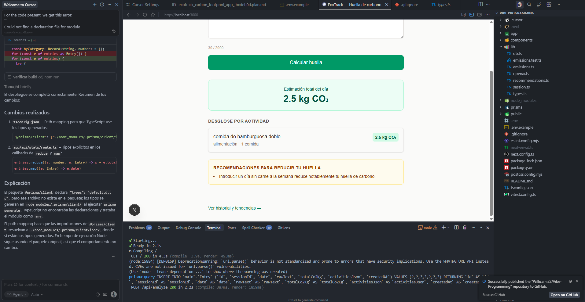
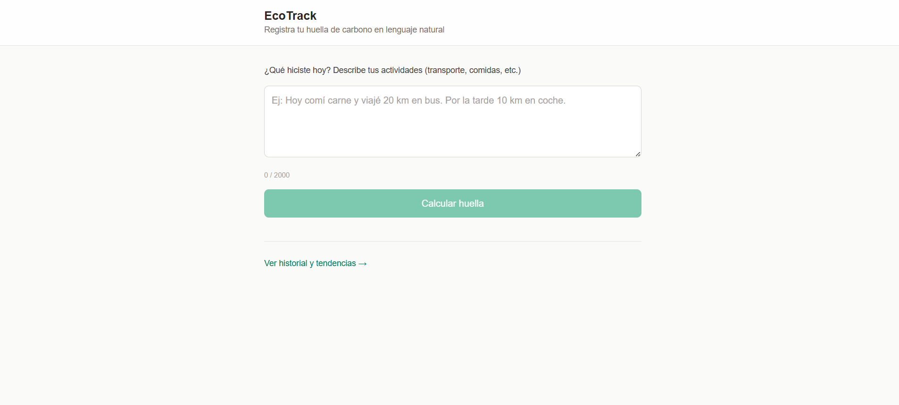

#  Vibe Report: Documentación del Proceso de Vibe Programming

> *Reflexión sobre la configuración y el flujo de trabajo con IA generativa*

---

## 1. Configuración de las Reglas del Agente

Para este proyecto trabajé con **Cursor** como editor principal y **Replit** como entorno de despliegue y pruebas en la nube.

En **Cursor**, configuré las reglas del agente desde la carpeta `.cursor/rules`, donde definí el contexto del proyecto: stack tecnológico, convenciones de nomenclatura, y restricciones de estilo. Le indiqué explícitamente que usara componentes funcionales en React, evitara librerías externas innecesarias, y mantuviera consistencia visual en el dashboard.

En **Replit**, aproveché el agente integrado para iterar rápidamente sobre la interfaz y resolver errores de entorno sin salir del navegador. La configuración fue más implícita: el agente infería el contexto del repositorio y el historial de cambios.

---

## 2. Dificultades al Delegar el Código a la IA

El mayor desafío fue **mantener la coherencia entre sesiones**. El agente no recuerda contexto previo entre conversaciones, lo que obligaba a re-explicar decisiones de arquitectura ya tomadas.

También encontré dificultades con:

- **Alucinaciones en dependencias**: la IA sugería imports de librerías con APIs desactualizadas o inexistentes.
- **Sobre-ingeniería**: el agente tendía a generar soluciones más complejas de lo necesario para funciones simples del dashboard.
- **Pérdida de intención visual**: al pedir cambios pequeños, el agente a veces reescribía secciones completas alterando el diseño original.

La solución fue ser más **directivo en los prompts**: en lugar de "mejora el dashboard", especificar "agrega un gráfico de barras en el componente `StatsPanel` usando los datos del array `weeklyData`".

*Vista del entorno de desarrollo y despliegue en Replit*

---

## 3. De "Escribir Código" a "Orquestar una Visión"

El cambio más profundo no fue técnico, sino **mental**.

Antes, programar significaba traducir ideas a sintaxis: pensaba en lógica, bucles, estado. Ahora, programar es más cercano a **dirigir**: comunico intención, evalúo resultados, corrijo rumbo.

La sensación es liberadora y desconcertante al mismo tiempo. Liberadora porque puedo materializar ideas complejas en minutos. Desconcertante porque la responsabilidad de *entender* el código generado recae completamente en mí — si no lo comprendo, no puedo validarlo ni defenderlo.

Lo que más cambió fue **dónde invierto la energía cognitiva**: ya no en recordar sintaxis, sino en tener claridad absoluta sobre qué quiero construir y por qué. La IA amplifica la visión, pero no la reemplaza.

*Dashboard desplegado y funcional*

---

## Conclusión

El Vibe Programming no es "dejar que la IA programe". Es aprender a ser un mejor comunicador de ideas técnicas. La herramienta más importante ya no es el teclado: es la precisión del pensamiento.

